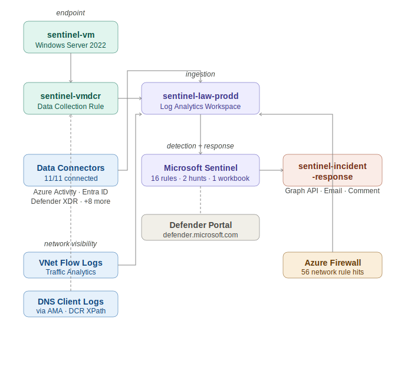

# Microsoft Sentinel SIEM Lab

A production-grade cloud security operations lab built on Microsoft Azure, demonstrating end-to-end SOC analyst workflow — from infrastructure deployment and log ingestion through detection engineering, adversary simulation, incident investigation, and automated response using Microsoft Sentinel and Azure Logic Apps.

## Overview

This lab simulates a functional Security Operations Center (SOC) environment with multi-source log ingestion, 16 custom KQL detection rules, threat intelligence integration, kill chain simulation, incident investigation, and SOAR automation. All components were deployed and configured manually to demonstrate practical cybersecurity engineering skills.

> **Note on baseline incidents:** This lab generated 261 total incidents over its lifetime. The majority were generated by the 11 connected data connectors during initial lab configuration — Azure Activity logs, Entra ID audit events, and Defender for Cloud alerts firing on normal administrative activity such as resource creation and role assignments. These baseline incidents confirm successful connector configuration and data flow. The four featured incidents (130, 131, 132, 133) were generated specifically by the custom KQL analytics rules firing on kill chain simulation telemetry and are the incidents investigated and documented in this repository.

---

## Architecture



**Cloud Platform:** Microsoft Azure — Canada Central (Personal Tenant — Global Admin)

**Core Components:**
- Microsoft Sentinel (SIEM + SOAR) — migrated to Defender portal (defender.microsoft.com)
- Log Analytics Workspace: sentinel-law-prodd, Canada Central
- Windows Server 2022 VM: sentinel-vm, Standard_D2s_v3, Canada Central
- Azure Monitor Agent with Data Collection Rule (sentinel-vmdcr)
- Data Collection Endpoint (sentinel-dce)
- Logic Apps Playbook: sentinel-incident-response (upgraded with Graph API)
- Azure Firewall: sentinel-firewall (deployed during simulation, deprovisioned after)
- VNet Flow Logs with Traffic Analytics → sentinel-law-prodd
- DNS Client Operational logging via AMA

**DCR Stream Routing:**
```
sentinel-vm (Windows Server 2022)
    │
    ▼
sentinel-vmdcr (DCR — 4 XPath channels)
    │   Security!* → Microsoft-SecurityEvent stream → SecurityEvent table
    │   PowerShell/Operational!* → Microsoft-Event stream → Event table
    │   DNS-Client/Operational!* → Microsoft-Event stream → Event table
    │   Application/System!* → Microsoft-Event stream → Event table
    ▼
sentinel-law-prodd (Log Analytics Workspace)
    │
    ▼
Microsoft Sentinel (16 Analytics Rules, 2 Hunting Queries, 1 Workbook)
    │
    ▼
sentinel-incident-response (Logic App Playbook)
    ├── Parse Incident Entities
    ├── Disable Account via Microsoft Graph API
    ├── Send Enriched Email (HTML)
    └── Add Incident Comment
```
---

## Data Sources — 11/11 Connectors

| Connector | Data Type | Purpose |
|-----------|-----------|---------|
| Azure Activity | AzureActivity | Cloud control plane monitoring |
| Microsoft Entra ID | SigninLogs, AuditLogs | Identity and access monitoring |
| Microsoft Defender for Cloud (Subscription) | Security alerts | Workload threat protection |
| Microsoft Defender for Cloud (Tenant) | Security alerts | Tenant-wide threat protection |
| Windows Security Events via AMA | SecurityEvent | Endpoint event monitoring |
| Microsoft Defender XDR | XDR signals | Extended detection and response |
| Microsoft Defender for Endpoint | Endpoint signals | EDR integration |
| Microsoft Defender for Identity | Identity signals | AD threat protection |
| Microsoft Defender for Office 365 | Email signals | Email threat protection |
| Microsoft Defender for Cloud Apps | CASB signals | Cloud app monitoring |
| Microsoft 365 Insider Risk Management | Insider risk | Insider threat detection |

---

## Data Collection Configuration

### Verbose Audit Policies — sentinel-vm

| Policy | EventID | Purpose |
|--------|---------|---------|
| Audit Process Creation + Command Line | 4688 | Full process execution tracking |
| PowerShell Script Block Logging | 4104 | Obfuscated command detection |
| PowerShell Module Logging | 4103 | Module-level activity |
| Audit Logon (Success + Failure) | 4624, 4625 | Logon tracking |
| Audit Other Logon/Logoff Events | 4648 | Explicit credential use |
| Audit Other Object Access Events | 4698 | Scheduled task creation |
| Audit File System | 4663 | File access operations |
| DNS Client Operational | DNS | DNS query logging |

Object-level auditing was configured on `C:\Windows\Temp` and `C:\Users\sentineladmin\AppData\Local\Temp` to enable 4663 generation for file staging detection.

### DCR XPath Configuration

Security events route to `Microsoft-SecurityEvent` stream → `SecurityEvent` table. All other events route to `Microsoft-Event` stream → `Event` table.

```
Security!*[System[(Level=1 or Level=2 or Level=3 or Level=4 or Level=0)]]
Microsoft-Windows-PowerShell/Operational!*[System[(EventID=4104)]]
Microsoft-Windows-DNS-Client/Operational!*
Application!*[System[(Level=1 or Level=2 or Level=3 or Level=4 or Level=0 or Level=5)]]
```

> The DCR was configured via Azure REST API after the portal UI failed to persist the `Microsoft-SecurityEvent` stream configuration — a known portal bug with custom stream routing.

---

## Detection Rules — 16 Custom KQL Analytics Rules

### Rules 1–8 — Initial Detection Coverage

| # | Rule | Severity | Data Source | MITRE |
|---|------|----------|-------------|-------|
| 1 | Multiple Failed Login Attempts | Medium | SecurityEvent 4625 | T1110 |
| 2 | Azure Resource Deletion Detected | High | AzureActivity | T1485 |
| 3 | Privileged Role Assignment Detected | High | AuditLogs | T1078.004 |
| 4 | Suspicious Sign-in From Unknown Location | High | SigninLogs | T1078 |
| 5 | New User Account Created Outside Business Hours | Medium | SecurityEvent 4720 | T1136 |
| 6 | High Volume Azure Activity From Single IP | Medium | AzureActivity | T1078.004 |
| 7 | Entra ID Account Locked Out | Medium | AuditLogs | T1110 |
| 8 | Malicious IP Detected in Logs | High | Multiple + Watchlist | T1071 |

### Rules 9–16 — Expanded Detection Coverage

| # | Rule | Severity | Data Source | MITRE |
|---|------|----------|-------------|-------|
| 9 | Suspicious Process Creation | High | SecurityEvent 4688 | T1059.001 |
| 10 | Persistence - Scheduled Task Created | Medium | SecurityEvent 4698 | T1053.005 |
| 11 | Execution - PowerShell Suspicious Commands | High | Event 4104 | T1059.001, T1027 |
| 12 | Lateral Movement - Explicit Credential Use | High | SecurityEvent 4648 | T1550.002, T1078 |
| 13 | Collection - Data Staging in Temp Directory | Medium | SecurityEvent 4663 | T1074.001 |
| 14 | Network - Suspicious Outbound Connection | Medium | AzureNetworkAnalytics_CL | T1071 |
| 15 | Discovery - Suspicious DNS Query | Medium | Event (DNS-Client) | T1071.004 |
| 16 | Network - Azure Firewall Rule Hit | Medium | AzureDiagnostics | T1071 |

All KQL queries are in `/kql-rules/`. MITRE ATT&CK coverage matrix is in `/documentation/mitre-attack-matrix.md`.

---

## Threat Intelligence

Two watchlists configured:

**MaliciousIPs** — 10 known malicious IP addresses sourced from public threat feeds including Tor exit nodes, malware C2 servers, known scanners, and botnet infrastructure. Rule 8 cross-references live log data against this watchlist in real time.

**ConditionalAccessBenignStatusCodes** — Benign Entra ID conditional access status codes used to reduce false positives on sign-in anomaly rules.

---

## Kill Chain Simulation

An 8-stage MITRE ATT&CK-mapped PowerShell simulation script was executed on sentinel-vm to generate real attack telemetry. Script available in `/attack-simulation/simulation.ps1`.

### Simulation Stages

| Stage | Tactic | Technique | Activity | EventID |
|-------|--------|-----------|----------|---------|
| 1 | Initial Access | T1110 | 10 failed login attempts | 4625 * |
| 2 | Execution | T1059.001, T1027 | Encoded PowerShell + download cradle | 4104, 4688 |
| 3 | Persistence | T1136 | Backdoor account svc_backup created | 4720 * |
| 4 | Persistence | T1053.005 | Scheduled task WindowsUpdateService | 4698 |
| 5 | Privilege Escalation | T1134 | Token/identity enumeration (whoami /all) | 4688 |
| 6 | Discovery | T1087 | net user, Get-LocalUser enumeration | 4688 |
| 7 | Collection | T1074.001 | 15 files staged in C:\Windows\Temp\svc_cache | 4663 |
| 7 | Command and Control | T1071.004 | DNS queries to pastebin.com, raw.githubusercontent.com | DNS |
| 8 | Defense Evasion | T1070 | Artifact cleanup | 4688 |

> \* EventIDs 4625 and 4720 did not fire from the initial simulation run. Azure Run Command executes as NT AUTHORITY\SYSTEM in a non-interactive session — Windows does not generate these authentication EventIDs in this context. This is an OS-level behavior, not a detection gap.

### Incidents Generated from Simulation

| Incident ID | Rule | Severity | MITRE | Investigated |
|-------------|------|----------|-------|-------------|
| 131 | Execution - PowerShell Suspicious Commands | High | T1059.001, T1027 | IR-001 |
| 133 | Persistence - Scheduled Task Created | Medium | T1053.005 | IR-002 |
| 130 | Discovery - Suspicious DNS Query | Medium | T1071.004 | IR-003 |
| 132 | Network - Azure Firewall Rule Hit | Medium | T1071 | Supporting evidence |

---

## Incident Investigations

Three full incident investigations completed following standard SOC incident response template. Full reports with timelines, investigation steps, findings, response actions, and lessons learned are in `/incident-reports/`.

**IR-001 — Execution: PowerShell Suspicious Commands (Incident 131)**
EventID 4104 captured encoded PowerShell via `-EncodedCommand` flag. Decoded content revealed `Get-Process` and `Get-LocalUser` enumeration. Download cradle targeting `raw.githubusercontent.com` captured in same session window. 12 script block events grouped into single High severity incident. Correlated with Incident 130 (DNS) and Incident 132 (Firewall) to build complete kill chain timeline.

**IR-002 — Persistence: Scheduled Task Created (Incident 133)**
EventID 4698 captured creation of task `WindowsUpdateService` by `sentineladmin` at 01:15:12 UTC. Full EventData XML confirmed task configured as Hidden, BootTrigger, HighestAvailable privilege via `powershell.exe -NonInteractive -WindowStyle Hidden`. Task naming mimics legitimate Windows service. Process chain traced to PowerShell session PID 3860, consistent with execution stage 24 minutes prior.

**IR-003 — Discovery: Suspicious DNS Query (Incident 130)**
DNS Client logs captured queries to `pastebin.com`, `raw.githubusercontent.com`, `github.com` at 04:52:17 UTC, 36 seconds after download cradle execution in IR-001. Azure Firewall logs corroborated 56 outbound connection attempts from 10.0.0.5 during same window. Multi-source correlation confirmed T1071.004 C2 communication pattern.

---

## SOAR Automation

### Playbook: sentinel-incident-response

Upgraded from basic email to full automated response workflow:

| Step | Action |
|------|--------|
| 1 | Parse incident entities — extract Account objects |
| 2 | Disable affected account via Microsoft Graph API (User.ReadWrite.All) |
| 3 | Send enriched HTML email: title, ID, severity, status, description, time, automated action |
| 4 | Add automated response comment to Sentinel incident |

**Managed Identity:** System-assigned managed identity granted `User.ReadWrite.All` via Microsoft Graph REST API — no stored credentials.

**Automation Rule:** `Auto-Respond-High-Severity` — triggers playbook automatically on all High severity incident creation events.

**Test result:** Playbook completed in 3.99 seconds. All 4 steps Succeeded. Enriched email received at lokhec22@gmail.com. Automated response comment confirmed on Incident 131.

---

## Workbook — Security Overview Dashboard

Custom workbook `Sentinel SIEM Lab — Security Overview` with 4 visualizations:

| Visualization | Type | Purpose |
|---------------|------|---------|
| Incident Trends — Last 7 Days | Time chart | Incident volume by severity over time |
| Top Alert Sources | Bar chart | Highest-volume detection rules |
| Alert Severity Distribution | Pie chart | Medium 136, High 109, Informational 16 |
| Top Impacted Hosts | Bar chart | sentinel-vm: 1.85K security events |

---

## Threat Hunting

Two custom hunting queries saved in Sentinel Hunting blade:

**H1 — Off-Hours Login Activity**
Detects successful logons outside 9AM-5PM. MITRE T1078. Hypothesis: attackers using compromised credentials prefer off-hours access when defenders are less likely to notice.

**H2 — Unusual Parent-Child Process Relationship**
Detects Office applications spawning cmd.exe or powershell.exe. MITRE T1566.001, T1059.001. Hypothesis: macro execution from phishing attachment.

---

## Network Visibility

**VNet Flow Logs** — enabled on sentinel-vm-vnet, Canada Central. Traffic Analytics with 10-minute processing interval pointing to sentinel-law-prodd.

> NSG flow logs were retired by Microsoft for new creation as of June 30, 2025. VNet flow logs are the current supported replacement.

**Azure Firewall** — deployed as sentinel-firewall during simulation window. UDR configured to route VM traffic through firewall. 56 network rule hits captured during kill chain. Deprovisioned after simulation. Logs persist in workspace.

---

## Architecture Limitations

| Limitation | Reason | Production Equivalent |
|-----------|--------|----------------------|
| AzureNetworkAnalytics_CL unpopulated — Rule 14 inactive | Traffic Analytics did not populate table within lab window | Resolves with sustained VM traffic within 60 min |
| Azure Firewall simulation-only | Free trial public IP quota + $1.25/hr cost | Permanent NGFW (Palo Alto, Check Point) via CEF/Syslog connector |
| No east-west lateral movement | Single VM | Second VM with AMA + VNet flow logs |
| EventIDs 4625/4720 not generated | Run Command SYSTEM context | Interactive RDP session + Sysmon |
| Geographic sign-in map excluded | Personal tenant insufficient location data | Enterprise tenant with diverse user base |

> In production, these detection thresholds require 30-day baseline calibration. See `/documentation/false-positive-analysis.md` for tuning guidance on Rules 11 and 13.

> KQL and Splunk SPL follow identical detection logic patterns. The detection engineering methodology here transfers directly to any SIEM platform with approximately 2-3 weeks of syntax familiarization.

---

## Skills Demonstrated

- Microsoft Sentinel deployment and Defender portal migration
- Multi-source log ingestion — 11 connectors
- DCR configuration via Azure REST API — stream routing and XPath management
- KQL detection rule authoring — 16 rules across SecurityEvent, AuditLogs, AzureActivity, Event, AzureDiagnostics
- MITRE ATT&CK mapping and kill chain coverage analysis
- 8-stage MITRE-mapped PowerShell kill chain simulation
- Incident investigation and documentation — 3 full reports
- SOAR playbook with Microsoft Graph API integration and managed identity
- Azure Firewall deployment with UDR and diagnostic log ingestion
- VNet flow log configuration with Traffic Analytics
- DNS Client Operational log collection via AMA
- Threat intelligence watchlist integration
- Threat hunting query development
- False positive analysis and detection threshold tuning

---

## Screenshots

Full screenshot index in repository. Key evidence screenshots:

| File | Description |
|------|-------------|
| setup/data_connectors.png | 11/11 connectors |
| setup/Analyticsrules.png | 8 initial rules |
| phase1/p1_security_events_flowing.png | SecurityEvent table confirmed |
| phase1/p1_event_4104_flowing.png | EventID 4104 confirmed |
| phase3/P3_vnet_flowlog_enabled.png | VNet flow log enabled |
| phase3/P3_firewall_diagnostic_settings.png | Firewall logs → Sentinel |
| phase3/P3_dns_sentinel_query.png | DNS events in Sentinel |
| phase4/P4_simulation_run_command.png | Kill chain execution output |
| phase4/P4_incidents_post_simulation.png | 4 simulation incidents |
| phase4/P4_firewall_logs_post_sim.png | 56 firewall hits |
| phase4/P4_analytics_all_rules.png | 16 rules active |
| phase5/P5_incident_131_powershell.png | IR-001 PowerShell incident |
| phase5/P5_incident_133_scheduled_task.png | IR-002 Scheduled task incident |
| phase5/P5_incident_130_dns_query.png | IR-003 DNS query incident |
| phase6/P6_logicapp_run_success.png | All 4 playbook steps Succeeded |
| phase6/P6_enriched_email.png | Enriched HTML email |
| phase6/P6_incident_comment.png | Automated response comment |
| phase7/P7_workbook1.png | Security overview dashboard |
| phase7/P7_hunting_queries.png | H1 and H2 hunting queries |

---
## Repository Structure

```
Microsoft-Sentinel-SIEM-Lab/
├── README.md
├── /kql-rules/
│   ├── multiple-failed-logins.kql
│   ├── azure-resource-deletion.kql
│   ├── privileged-role-assignment.kql
│   ├── suspicious-signin.kql
│   ├── new-user-outside-hours.kql
│   ├── high-volume-activity.kql
│   ├── entra-id-lockout.kql
│   ├── malicious-ip-detection.kql
│   ├── suspicious-process-creation.kql
│   ├── scheduled-task-created.kql
│   ├── powershell-suspicious-commands.kql
│   ├── lateral-movement-explicit-credential.kql
│   ├── data-staging-temp-directory.kql
│   ├── network-suspicious-outbound.kql
│   ├── suspicious-dns-query.kql
│   └── azure-firewall-rule-hit.kql
├── /attack-simulation/
│   ├── simulation.ps1
│   └── attack_simulation.ps1
├── /incident-reports/
│   ├── IR-001-powershell-suspicious-commands.md
│   ├── IR-002-scheduled-task-created.md
│   └── IR-003-suspicious-dns-query.md
├── /documentation/
│   ├── architecture-diagram.svg
│   ├── mitre-attack-matrix.md
│   ├── false-positive-analysis.md
│   └── architecture-limitations.md
├── /threat-intelligence/
│   └── malicious_ips.csv
└── /screenshots/
    ├── /setup/
    ├── /phase1/
    ├── /phase2/
    ├── /phase3/
    ├── /phase4/
    ├── /phase5/
    ├── /phase6/
    └── /phase7/
```
---

## Author

**Sanskar Lohani**
MS Cybersecurity — Florida International University (GPA 3.96)
[linkedin.com/in/slohani22](https://linkedin.com/in/slohani22) | [github.com/slohani-22](https://github.com/slohani-22)

**Certifications:** CompTIA Security+ (SY0-701) | AZ-500 Microsoft Azure Security Engineer
